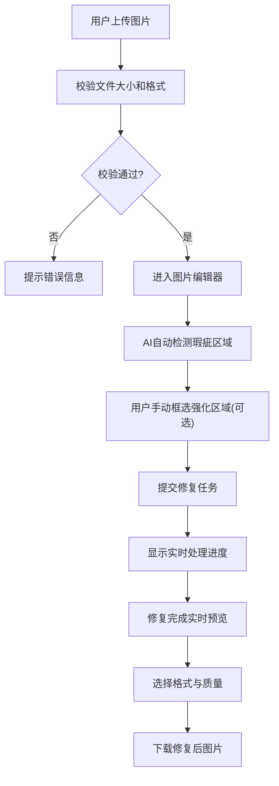

## 1. 产品概述

图片智能修复工具是一款基于AI技术的网页端图像瑕疵处理应用，支持水印去除、划痕修复、污渍清除等功能。用户可上传带瑕疵的图片，系统自动识别并进行无痕修复，同时支持手动框选区域强化处理，适用于单张及少量批量处理场景。

- 解决用户去除图片水印、划痕、污渍等瑕疵的痛点
- 面向设计师、摄影师、内容创作者及普通用户
- 提供高精度、高效率的图像修复体验，支持浅水印与密集瑕疵专项适配

## 2. 核心功能

### 2.1 功能模块

1. **首页/工作台**：图片上传区、处理队列、历史记录
2. **图片编辑器**：图像预览、瑕疵自动检测、手动区域框选、修复参数调整
3. **下载中心**：多格式导出、批量下载、质量选择

### 2.2 页面详情

| 页面名称 | 模块名称 | 功能描述 |
|----------|----------|----------|
| 工作台 | 拖拽上传区 | 支持拖拽/点击上传，显示文件大小限制与支持格式 |
| 工作台 | 处理队列 | 展示当前处理任务进度、状态、缩略图 |
| 工作台 | 历史记录 | 展示已处理图片列表，支持重新编辑与下载 |
| 图片编辑器 | 图像预览 | 原图与修复结果实时对比预览 |
| 图片编辑器 | 瑕疵检测 | AI自动识别水印、划痕、污渍区域并标注 |
| 图片编辑器 | 手动框选 | 支持矩形/自由形状框选指定区域强化处理 |
| 图片编辑器 | 进度展示 | 实时显示处理进度条与阶段状态 |
| 下载中心 | 格式选择 | 支持PNG/JPG/WebP/TIFF多格式导出 |
| 下载中心 | 质量参数 | 图片压缩质量与分辨率选择 |
| 下载中心 | 批量操作 | 批量选择、打包下载 |

## 3. 核心流程

用户上传图片 → 系统校验文件大小与格式 → 进入编辑器 → AI自动检测瑕疵区域 → 用户可手动框选强化区域 → 提交修复任务 → 实时显示处理进度 → 修复完成实时预览 → 选择格式下载。

## 4. 用户界面设计

### 4.1 设计风格

- **主色调**：深空蓝 #0F172A 为背景基底，搭配科技感青蓝 #22D3EE 作为强调色
- **辅助色**：暖琥珀 #F59E0B 用于操作提示与进度，纯白 #FFFFFF 用于文字与图标
- **按钮风格**：圆角胶囊按钮，悬停有辉光动效，按下有微缩反馈
- **字体**：标题使用 Space Grotesk，正文使用 Geist Sans，数字使用 JetBrains Mono
- **布局风格**：深色科技风，卡片式模块化布局，玻璃态毛玻璃面板
- **图标风格**：使用 Lucide 线性图标，统一 2px 描边

### 4.2 页面设计概览

| 页面名称 | 模块名称 | UI 元素 |
|----------|----------|---------|
| 工作台 | 上传区 | 虚线边框、渐变背景、拖拽悬停高亮、文件大小与格式提示 |
| 工作台 | 处理队列 | 卡片网格布局、进度环、状态徽章、缩略图 |
| 图片编辑器 | 预览区 | 双栏对比、放大缩小、瑕疵标注蒙版、框选工具浮层 |
| 图片编辑器 | 工具栏 | 工具图标按钮、强度滑块、模式切换 |
| 图片编辑器 | 进度条 | 渐变进度条、阶段文字提示、脉冲动效 |
| 下载中心 | 格式面板 | 单选卡片、质量滑块、分辨率选择、下载按钮 |

### 4.3 响应式设计

- 桌面端优先设计（1440px+）
- 平板端（768px-1024px）：双栏变单栏，工具栏折叠
- 移动端（<768px）：简化上传流程，优化触控区域

