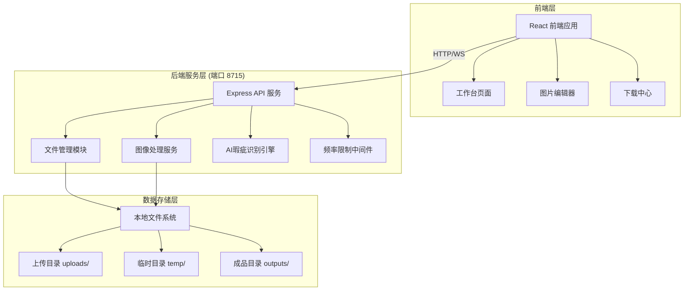
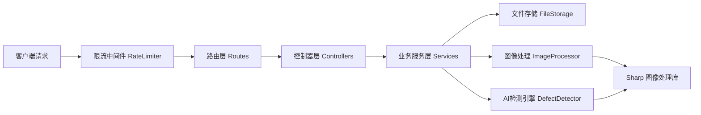

## 1. 架构设计



## 2. 技术描述

- **前端**：React@18 + TypeScript + Vite + React Router@6 + Zustand + TailwindCSS@3 + Lucide React
- **后端**：Express@4 + TypeScript + Multer（文件上传） + Sharp（图像处理）
- **初始化工具**：vite-init（react-express-ts 模板）
- **AI 图像修复**：基于 Canvas API + 图像处理算法（inpainting 模拟实现）
- **通信方式**：HTTP REST API + SSE（服务器发送事件，用于进度推送）

## 3. 路由定义

| 路由 | 页面 | 用途 |
|------|------|------|
| / | 工作台 | 图片上传、处理队列、历史记录 |
| /editor/:id | 图片编辑器 | 瑕疵检测、区域框选、修复操作 |
| /download/:id | 下载中心 | 格式选择、质量参数、下载导出 |

## 4. API 定义

### 4.1 类型定义

```typescript
interface UploadImageResponse {
  id: string;
  filename: string;
  originalName: string;
  size: number;
  mimeType: string;
  width: number;
  height: number;
  previewUrl: string;
}

interface DetectionRegion {
  id: string;
  type: 'watermark' | 'scratch' | 'stain';
  confidence: number;
  bbox: { x: number; y: number; width: number; height: number };
}

interface DetectDefectsResponse {
  imageId: string;
  regions: DetectionRegion[];
  processingTime: number;
}

interface RepairRequest {
  imageId: string;
  regions: Array<{
    id?: string;
    type?: 'watermark' | 'scratch' | 'stain' | 'manual';
    bbox: { x: number; y: number; width: number; height: number };
    strength?: number;
  }>;
  mode?: 'auto' | 'light-watermark' | 'dense-defects';
}

interface RepairProgress {
  taskId: string;
  stage: 'detecting' | 'processing' | 'refining' | 'completed' | 'error';
  progress: number;
  message: string;
  resultUrl?: string;
}

interface DownloadOptions {
  format: 'png' | 'jpg' | 'webp' | 'tiff';
  quality: number;
  scale: number;
}
```

### 4.2 API 端点

| 方法 | 路径 | 描述 |
|------|------|------|
| POST | /api/upload | 上传图片 |
| GET | /api/images/:id | 获取图片信息 |
| POST | /api/images/:id/detect | AI检测瑕疵区域 |
| POST | /api/images/:id/repair | 提交修复任务 |
| GET | /api/tasks/:taskId/progress | SSE 订阅修复进度 |
| GET | /api/images/:id/download | 下载修复后图片（带format/quality/scale参数） |
| GET | /api/history | 获取历史处理记录 |
| DELETE | /api/images/:id | 删除图片及相关文件 |

### 4.3 请求限制

- 单文件大小：最大 10MB
- 频次限制：每分钟最多 30 次请求，每 IP 每小时最多 100 次修复任务
- 批量限制：单次最多上传 10 张图片

## 5. 服务端架构图



## 6. 目录结构

```
lp0055/
├── src/                          # 前端源码
│   ├── components/               # 通用组件
│   │   ├── ImageUploader.tsx     # 图片上传组件
│   │   ├── ProgressBar.tsx       # 进度条组件
│   │   └── ...
│   ├── pages/                    # 页面组件
│   │   ├── Dashboard.tsx         # 工作台
│   │   ├── ImageEditor.tsx       # 图片编辑器
│   │   └── DownloadCenter.tsx    # 下载中心
│   ├── hooks/                    # 自定义 Hooks
│   ├── store/                    # Zustand 状态管理
│   ├── utils/                    # 工具函数
│   └── types/                    # 类型定义
├── api/                          # 后端源码
│   ├── controllers/              # 控制器
│   ├── services/                 # 业务服务
│   ├── middleware/               # 中间件
│   ├── routes/                   # 路由
│   ├── types/                    # 类型定义
│   └── index.ts                  # 入口（监听 8715 端口）
├── shared/                       # 前后端共享类型
├── uploads/                      # 上传图片存储
├── temp/                         # 临时文件存储
├── outputs/                      # 修复完成图片存储
└── ...
```
